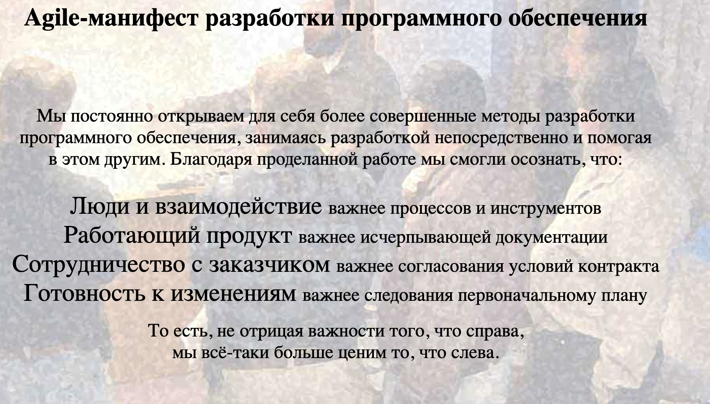

## Жизннный цикл разработки ПО

#### Изучение методологии Waterfall(Водопадная модель):
- **Принципы модели**:
    - Все этапы разработки должны быть закодументированы;
    - Следующий этап не начнеться, пока не закончиться предыдущий;
    - Пропуск этапов исключен;
    - Изменено требование, значит нужно внести изменения в ТЗ;
    - Нет отката на прошлый этап;
    - Прооисходит в рамках одного общего процесса, нет интиеграции;
    - Выявление и исправление ошибок происходит только после разработки, на этапе тестирование продукта;
    - Клиент учатсвует в проекте только на этапе создания ТЗ.

- **Преимущества модели**:
    - Устойчивость к замене исполнителя(т.к. имеется вся документация с описанием процесса);
    - Инструкция и правила по всему процессу разработки;
    - Строгий менеджемени(модель заставляет быть разработчиков быть дисциплинированными, соблюдая четкую последовательность этапов);
    - Гибкость на первых этапах разработки(в первых фазах изменения могут быть произвелены без существенных затрат);
    - Определенность в сроках и размере бюджета;

- **Недостатки модели**:
    - Недостаточная гибкость модели(клиент не может вносить правки в проект во время разработки, нет откатов на предыдущий этап);
    - Большой объем окументации(так как все этапы и процессы задокументированы, то очень сложно поддерживать актуальность документации);

#### Изучения методологии V-model;

Это высокодисциплинированная модель разработки ПО, в котором каждому этапу разработки соответствующий этап тестирования, проводимый паралельно.

- **Основные этапы модели**:
    - Сбор требований;
    - Проектирование системы;
    - Проектирование модулей;
    - Интеграционное тестирование;
    - Системное тестирование;
    - Приемочное тестирование.

- **Преимущества модели**:
    - Увеличение эффективности команды(подход способствует более тестному взаимодействию участников проекта);
    - Высокое качество ПО;
    - Подходит для проектов с фиксированными требованиями.

- **Недостатки модели**:
    - Отсутсвие гибкости(при появление изменений нужно возращаться на начальные этапы);
    - Высокие риски при изменении требований(при появление изменений нужно пересмотра многих этапов и компонентов);
    - Неэфективность для маленьких проектов(детальное соблюдение модели может быть нецелесообразно для маленьких проектов).

#### Изучение методологии Incremental Model:

Это методология разработки ПО, основанная на последовательном выпуске функциональных блоков продукта. Каждый блок представляет собой отдельное работающее програмное решение, которое может быть дополнено новыми функциями на последующих этапов разработки.

- **Основные этапы модели**:
    - Планирование;
    - Разработка первого инкремента;
    - Тестирование первого инкремента;
    - Разработка второго инкремента;
    - Тестирование второго инкремента;
    - Повторение разработки и тестирование инкремента;
    - Завершение проекта.

- **Преимущества модели**:
    - Гибкость и адаптивность(можно быстро реагировать на изменения требований к продукту, добовляя новые функции и изменяя существующие);
    - Улучшенное качество продукта(многократное тестирование и отладка каждого инкремента);
    - Сокращение времени на разработку(ускорить процесс разработки отдельных блоков и их тестирование независимо друг от друга);
    - Улучшение управление проектом(представляет более детальное планирование и контроль каждого этапа разработки);
    - Увеличение шансов на успех проекта(позволяет быстрее реагировать на изменение требований и вносить корриктровки).

- **Недостатки модели**:
    - Не подходит для всех типов проектов(если четкие сроки и определенный бюджет);
    - Требует усилинного управлени(каждый икримент должен быть тщательно протестированный и проверен);
    - Риск завышенных ожиданий(если клиент не понимает что каждый инкремент имеет свой функционал, а не весь сразу);
    - Необходимость более высокой квалификации сотрудники(требует более высокой квалификации от участников проекта).

#### Изучение методологии Scrum:

Это гибкая методология разработки, используемая для управления проектов и создание продуктов, особенно в условиях изменяющихся требований. Предпологает работу коротких циклах, называемых спринтами, и фокусировки на постоянной обратной связи и адаптации.

- **Основные этапы модели**:
    - Формирование списка задач продукта;
    - Планирование спринта(1-4 недели);
    - Работа над спринтом;
    - Обзор спринта(демонстрация готового инкримента, получение обратной связи);
    - Ретроспектива спринта(анализ работы команды, планирование изменений спринта);

- **Преимущества модели**:
    - Гибкость(возможность быстро адаптироваться к изменениям требованиям);
    - Прозрачность(все участники видят прогресс и проблемы);
    - Ранняя поставка продукта(рабочие версии появляются уже после первых спринтов);
    - Снижение рисков(ошибки выявляются на ранних этапах);
    - Мотвация команды(самоорганизация и вовлеченность в процесс).

- **Недостатки модели**:
    - Зависимость от команды(требуються высококвалифицированные специалисты);
    - Сложность маштабирования(не подхоят для крупных проектов с жесткими сроками и бюджетом);
    - Регулярные встречи(ежедневные планерки могут отнимать время);
    - Жесткие рамки спринтов(во время спринта нельзя добавлять изменения);
    - Риск "бесконечных дороботок"(частые изменения могут затягивать проект);

#### Изучение методологии Kanban:

Это гибкий метод разработки ПО, основанный на визуализации потока задач и ограничении работы в прогрессе. В отличии от Scrum, не использует спринты, а фокусируется на постоянном потоке задач.

- **Основные этапы модели**:
    - Визуализации рабочего процесса;
    - Ограничение рабочего прогресса(не может выполнять больше назначенного количества задач);
    - Управление потоком(анализируется время в задачи, возможность добавление новых лиц, для ускорение рабочего процесса);
    - Прозорачность и явные правила(четкое понимания процесса всеми учасниками);
    - Постоянно улучшение процесса.

- **Преимущества модели**:
    - Гибкость(нет жестких спринтов);
    - Прозрачность(всем видны задачи);
    - Снижение перенагрузки(лимит по задачам);
    - Подходит для поддержки и DevOps.

- **Недостатки модели**:
    - Нет дедлайнов;
    - Сложно масштабировать на больших проектов;
    - Требует дисциплины;

#### Изучение манифеста

 

- **Люди и взаимодействие важнее процессов и инструментов**:
важно, чтобы люди могли учиться и совершенствоваться.
Важно, что бы люди были счастливы и мотивированы, что бы люди могли общаться и взаимодействовать друг с другом, что бы люди моглу учиться и совершенствоваться, принимать решение и брать ща них ответственность.

- **Работающий продукт важнее исчерпывающей документации**:
важно что бы продукт был рабочим, а не просто дукоментация.

- **Сотрудничество с заказчиком важнее соглашения условний контракта**:
важно что бы заказчик был вовлечен в процесс разработки, что бы заказчик был удовлетворен.

- **Готовность к изменениям важнее следования первоначальному плану**:
важно что бы команда была готова к изменениям, ведь не все может идти по первоначальному плану.

- **То есть не отрицая важности того, что справа, мы всё-таки больше ценим то, что слева**:
несмотря на важность "правого", отдаем приоритет "левому".